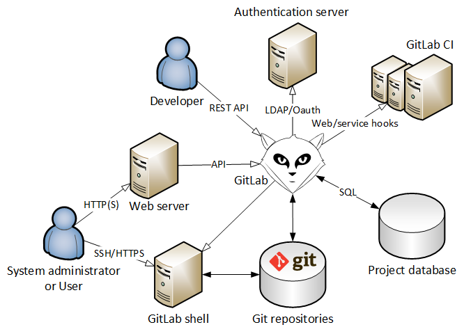

# GitLab Context View

## Introduction

As John Donne might say, *no system is an island, entire of itself*. All systems operate in some larger environment, interacting with stakeholders or external systems. Because the system context is very relevant to the software architecture, it is important to include a description of this context as part of the architectural description.

We will make use of a viewpoint-based architectural approach as described by Rozanski and Woods, in particular the *Context Viewpoint* as described in [1], [2].

This document presents a context view for GitLab. It defines the scope of the system – what it does and does not do, where the boundaries are between it and the outside world. In addition, it identifies external entities, defining the relationships, dependencies, and interactions between GitLab and these entities.

## System Scope

In this particular view, we will treat GitLab as a black box and focus on the external entities and their relationship with GitLab. To do so, we need to explicitly define GitLab's scope in order to know where to place the boundary.

### Capabilities

What GitLab does:

* Allow a system administrator to manage repositories, users, and access permissions.
* Allow the user to create and manage projects through a web interface.
* Allow users to communicate through issues, comments, and wiki pages.
* Integrate with git, allowing users to contribute to projects using a git server.

### Exclusions

What GitLab doesn't do:

* Provide a server, git installation, or SQL database. These will need to be set up and configured by a system administrator. However, various installation scripts exist to help with this task.
* Perform automated builds, tests, and other such tasks. (The separate GitLab CI project is working on this.)

## Situations

In order to identify the external entities that might interact with a GitLab installation, we consider different usage scenarios for the software. For each of these scenarios we will list potentially relevant entities, so that we can incorporate these in a context diagram.

### Base scenario: Individual user Dan
As a developer, I'm using GitLab on my server so that I can safely store the code for my home page and blog. I'm the only user who's using this GitLab instance. On my server I use Nginx to serve web pages and an SQLite database for storage.

We can now identify two lists of entities that interact with the system. Note that in this scenario, developer Dan is the owner of each of these systems.

**People:**

* User: in this scenario, developer Dan is the sole user of the system.
* Sysadmin: here, Dan also functions as sysadmin.

**Potential entities:**

| Name             | Nature     | Owner  | Responsibilities |
|------------------|------------|--------|----------------|
| Project Database | Data store | Dan    | Storing data used by applications |
| Web Server       | System     | Dan    | Presenting web pages to users |
| Git repositories | Data store | Dan    | Storing file changes on disk |
| Git client       | System     | Dan    | Sending and retrieving file changes |

The site-related entities don't interact with GitLab directly (although GitLab CI may), so these would disqualify for our context view. The git client and git repositories however, directly talk to GitLab.

### Larger scenario: Enterprise user Erik
As an enterprise user, I'm using GitLab in my organization to store the code used by multiple development teams. For user authentication we rely on our enterprise LDAP server and we have separate departments handling operations and administration of the system. Because of the large amount of developers working on projects we use GitLab CI to create builds and run tests.

**People:**

* User: employees of the company (developers, testers and project managers)
* Sysadmins: Operations department

**Potential entities:**

| Name             | Nature     | Owner             | Responsibilities |
|------------------|------------|-------------------|------------------|
| LDAP server      | System     | Operations dept.  | Providing user authentication and authorization information |
| GitLab CI        | System     | Operations dept.  | Checking the build state of software |

GitLab can integrate with each of these entities, either out of the box or through plug-ins.

## Context View

In the context view we present an overall picture of the system in its natural habitat. In order to identify the different entities that might be relevant for in our view we will describe the following components, as outlined by Rozanski and Woods:
First of all **GitLab** itself is included, presented as a 'black box' to hide any implementation-related distractions.
Secondly we will show **external entities**, which can be services or applications that have some relation to the GitLab project, showing both the *name* of the entity, the *nature* of the entity, its typical *owner* and its *responsibilities*.
Finally we show the **interfaces** between GitLab and the external entities, for which we highlight the key *interactions* across this interface, the *semantics* of the interface (such as the type of data), *exception processing* when unexpected behavior occurs and finally the *quality properties* of the interface.

### Entities

Using the scenarios of our earlier chapter we have identified the following entities:

| Name             | Nature     | Responsibilities |
|------------------|------------|------------------|
| Project database | Data store | Storing data used by applications |
| Web server       | System     | Presenting web pages to the users |
| Git repositories | Data store | Storing file changes on disk |
| Users            | People     | Sending and retrieving file changes |
| Administrators   | People     | Managing GitLab (users, projects, etc) |
| Authentication server       | System     | Providing user authentication and authorization information |
| External services (e.g. CI) | System     | Checking the metrics/build state/etc of software |

### Interfaces

As we now have identified several entities, we can take a look at the interfaces that exist between these entities and GitLab.

#### Project database
**Interactions and semantics.** The communication with the project database happens through this interface. It serves as a data provider and consumer as it both stores (consumes) and retrieves (provides) information in and from the database. All the persistent data of GitLab that is not stored in the repositories is stored in this database (e.g. teams, wikis, issues, etc). The project database can either be a MySQL or a PostgreSQL database.

**Characteristics.** Because the database reflects several main GitLab models (e.g. projects, users, issues) the number of request is high. With every page view there will be multiple requests to the database. However, the size of the request is often rather small. These interactions are performed automatically. Furthermore there is authentication required to query the database. The response time of the interface should be fast and the 'communication protocol' is SQL.

#### Web server
**Interactions and semantics.** The webserver enables the users to access GitLab via their browser. It supports HTTP requests, which are needed in order to view the required information, such as the dashboard, repository content or issues via the web interface. Furthermore it enables users to actually interact with GitLab, by for instance storing issues, accepting pull requests or adding comments to lines of code. This means that the webserver is mainly a service provider, although it also plays a minor role as data provider and consumer and event provider and consumer. However, these data and events are created or retrieved by means of the services that the webserver supplies. Examples of webservers are Apache and Nginx.

**Characteristics.** For each client, the webserver does not process a large amount of data, although in some cases the amount of clients (user that access the web interface) can be quite large. All these users have to be served and request that the pages they want to access are loaded quickly. This means that there can be quite some extensive HTTP traffic that the server has to process simultaneously in a small time window. Besides that, multiple calls to the database might be needed to retrieve the requested information, which also implies quite some load.  
The services are initiated by the clients that want to access the web interface. The transactions can be seen as batch transactions. Although they are not very big, each page load is a clearly delimited batch operation. These operations require authentication from the user. Generally, the HTTP protocol is used to retrieve web pages for the users (for instance in HTML).

#### Git repositories
**Interactions and semantics.** This interface represents the communication between the actual git repositories, which are located on the disk, and GitLab. From the viewpoint of GitLab it serves multiple purposes.
As (1) a data provider or consumer it can transfer blobs (file contents) from or to the repository to GitLab. It also provides (2) a service that can create and manage the Git repositories. And finally it acts as (3) an event provider, because GitLab is notified when new content is committed to a repository.

**Characteristics.** The number of requests through this interface will be very high, almost every action taken by GitLab will require communication with the repository (e.g. file view, file change, new repository, new commits, merging, etc). The size of the data is often not large, in most of the cases the request is a service call or viewing a diff. As the number of repositories grows the number of requests will also grow. The interface is expected to have a low latency, the changes in the repository must reflect quickly to GitLab. There is no specific protocol associated with this interface, the calls are invoked by system calls (command line).

#### Users
**Interactions and semantics.** The users (a.k.a. software developers) can interact with GitLab in two different ways, with two different interfaces. The first way is through the web server. Users can post or view issues, comments or edit/view source files via the web interface, so from the web server's perspective the user is a service consumer.  
The second way to interact with GitLab is by pushing/pulling commits (file changes) to/from a git repository. In this case, the users act like data providers and consumers.

**Characteristics.** The two different interfaces have also two different characteristics. The first interface (via the web server) must be able to handle a large number of requests, because each page view in the browser represents multiple requests. It must also be able to handle request of various sizes, often the response is only a web page, but it is not inconceivable that a user will download a whole repository as zip archive. For the latter the response may be presented in a streaming fashion. Furthermore, the interactions through this interface are completely manual and the response time must be quick. The interface should be protected from unauthorized access and can be secured by using the HTTPS protocol instead of the normal HTTP protocol.  
The second interface, that interacts with the git repositories, doesn't have to handle the same number of requests as the previous interface. In fact it will be less. The size of the requests can be of any size, the data (file deltas) from the user to the repository can hold any kind of files (binary or text). Like the previous interface, the interactions are completely manual, but the response time doesn't have to be very fast. The interface should be protected from unauthorized access and is secured by using the SSH protocol.

#### Administrators
**Interactions and semantics.** System administrators maintain the GitLab installation (e.g. they make sure that the list of users is up-to-date). In order to do that they interact to GitLab via the web server. The administrators therefore act like service consumers. 

**Characteristics.** As this interface is more or less the same as the web server interface for users, the same characteristics apply here.

#### Authentication server
**Interactions and semantics.** This interface takes care of the communication between the authentication server and GitLab. From GitLab's point of view it acts as a service provider. The authentication server has a list of valid users and offers an authentication service for those users. The parameters for the service call are the user credentials. If GitLab wants to know if the crendentials provided by the end user are valid, it initiates a service call to the service to authenticate the user. The response contains information on whether the user is valid and authorized or not.

**Characteristics.** The size and the number of requests through this interface will be relatively small, the service is called every time a user logs in and only contains a limited amount of parameters. There is no need to call the service again until the user's session is expired. The call to the authentication server is completely automated and needs to be completed within a small time window as this is a bottleneck to using the service that is actually requested by the user. The protocol used for the communication can be LDAP or OAuth and maybe some other supported protocols. The authentication is a batch operation (authenticating one user can be seen as one batch) an obviously needs to be done in a very secure way, such that credentials cannot be retrieved by malicious parties.

#### External services: web and service hooks
**Interactions and semantics.** GitLab supports extensions through web and service hooks. Web hooks are invoked after a certain action is fired (e.g. a new commit). GitLab initiates a HTTP POST request to a user defined web service. The POST request contains information about the event that triggered the invocation. GitLab also supports service hooks, these hooks go deeper in the system than web hooks. For example it is possible to hook into the web interface to show extra components (like the build state of a project).
One of the external services that we looked into is GitLab's own CI server. It enables the user of GitLab to automatically build projects and run tests for Continuous Integration. The CI server is a separate entity which talks to the GitLab server, probably by means of HTTP requests to the web server. This means it is at least a data consumer, as it requests the contents of a repository in order to build it. Second it is a service consumer, as it uses the services that are provided by the web server. Depending on whether the project is built periodically or on each git push, the GitLab CI server might also be an event consumer.  
Furthermore, when we see what data is transferred from the GitLab CI server back to the GitLab server, we can conclude that the GitLab CI server is also a service provider (as building the project can be seen as a service) and an event provider (as GitLab can be notified when a build fails).

**Characteristics.** The characteristics of the interface depend on the external services that is used. However we defined the characteristics of the interface to the GitLab CI server. The CI server can be processing quite extensive volumes of data, depending on the size of the project. On each build, the latest version has to be pulled from the git repository, after which the project is built. As mentioned above, these builds can either be scheduled, or be initiated by a git commit to the repository. Building a project is completely automated (in fact, this is one of the main purposes of a CI server) and are not transactional, as the server won't break when a built can not be finished successfully. The interaction with the GitLab server are clearly batch operations, as each build is a clearly delimited batch. These builds are not very time critical. This is mostly because building a project can take quite some time, depending on the size of the project, to which developers are used. The scalability of this service is very important.

### Context Diagram

In this diagram, GitLab is treated as a black box. The external entities – systems as well as people – that we identified above are incorporated. Arrows indicate data flows. The direction of open arrows indicate the direction of a request. Closed arrows are data reads/writes.

## References

1. Woods, Eoin, and Nick Rozanski. "The system context architectural viewpoint." Software Architecture, 2009 & European Conference on Software Architecture. WICSA/ECSA 2009. Joint Working IEEE/IFIP Conference on. IEEE, 2009.
2. Rozanski, Nick, and Eóin Woods. Software systems architecture: working with stakeholders using viewpoints and perspectives. Addison-Wesley Professional, 2011.
