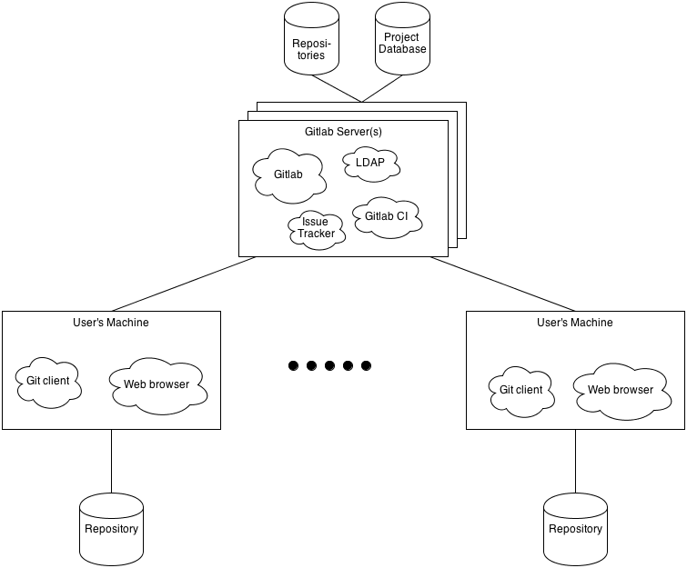

# GitLab Deployment View

## Introduction
A very important element in designing a system is defining the environment in which the system will be deployed. No matter how well designed and implement a system might be, if it doesn't align with the environment it is deployed in, it will be rather useless. Therefore, the deployment view is also a very important element in the documentation of a system's architecture.  
The importance of the Deployment View for GitLab is backed by Rozanski and Woods1, who state:
> The Deployment viewpoint applies to any information system with a required deployment environment that is not immediately obvious to all of the interested stakeholders. This includes the following scenarios:
> * Systems with complex runtime dependencies
> * [...]

As discussed in the [GQM document](Metrics.md), one of the main concerns we found for GitLab is the amount of dependencies of the system. That is why we found that it would be important to discuss the Deployment View for GitLab which will be done according to the models proposed by Rozanski and Woods:
* Runtime Platform Models
* Network Models
* Technology Dependency Models

## Runtime Platforms

### Environment
As discussed in [the Stakeholders document](Stakeholders.md), GitLab will be run and maintained on a server by a system administrator. This means that the environment of GitLab is rather an abstract environment instead of physical environment, because GitLab, or actually the server, can be placed in any physical environment, as long as the server has a power supply and is connected to the internet.  
Once GitLab is installed on a server, interaction between GitLab and its abstract environment is initiated by the users of GitLab.

From the bottom up, we first have project participants that are using GitLab. As discussed earlier there are roughly two ways these participants interact with GitLab: either by pushing and pulling commits via the git protocol, or collaborate and communicate by means of issues and pull requests. The latter can be done by assessing the GitLab installation with an internet browser, which means that they in fact interact with GitLab by means of HTTP requests.  

Second, there are project managers that, besides acting as a project participant, have the additional task of managing one or more repositories. Managing these repositories can done by assessing GitLab with an internet browser or with the GitLab shell on the server.  

Last, there are system administrators that can either operate directly on the server, or via a remote session. These administrators basically have all the rights needed to use and manage repositories but also manage GitLab and its dependencies. This means that they interact with, but also manage, GitLab by means of the GitLab shell, bash commands and other protocols used by dependencies such as MySQL, Python and Ruby.

### Environment Design
In this section, we will discuss the various nodes that are apparent in the environment of GitLab, according to the Runtime Platform Model presented by Rozanski and Woods. The entities in this model are presented in the diagram below.

This diagram can be mapped to the proposed entities of the Runtime Platform model in the following way:

| Rozanski and Woods' entity | Element in the diagram |
|---|---|
| Processing Nodes | The processing nodes of the model can be mapped to the server(s) on which GitLab is installed. For hosting a limited amount of repositories with only a fair amount of collaborators one server should be enough. However if the amount of collaborators and therefore server load increases beyond the server capacities, it might be necessary to construct a cluster of servers representing one GitLab instance.  As you can see, these servers run different important processes such as LDAP and perhaps GitLab CI or an issue tracker, and of course GitLab itself. For the processing nodes it is important to have sufficient processing power, memory and storage space, which will be discussed later. |
| Client Nodes | The client nodes in this diagram are the GitLab users which operate with GitLab either via a web browser or by means of the Git protocol. The requirements for their processing power, memory and disk space are less eminent, but will also be discussed later.|
| Online Storage Hardware | The required online storage hardware are the (perhaps remote) hard disks of the GitLab server(s) on which the repositories and the database containing the projects are stored. The amount of storage needed is difficult to estimate as it depends on the size of the projects that are stored on the server. The storage capacity of a server can easily be increased, however. |
| Offline Storage Hardware | The offline storage hardware in this system is represented by the storage hardware of the GitLab users. This storage is used for storing the repositories in which they participate. |
| Network Links | The only important network links in this system are the links between the GitLab server and the GitLab users, which are usually facilitated by the internet. A network link between GitLab users is not necessary for collaboration. |

### Hardware Requirements - Server side
According to the model presented above, we have conducted the following hardware requirements for a GitLab server. In essence, the only hardware components that are needed to actually run GitLab is a working server. However, in order to use GitLab for collaboration on various projects, some basic requirements are added to this:

| Component | Requirements |
|---|---|
| Processing power | GitLab recommends a processor with **4 cores**, although 2 cores is the minimum to responsively run an unmodified installation.2|
| Memory | 768 MB is the minimal amount of memory required and supports up to 100 users. 1 GB is recommended, this will support up to 1,000 users, while 1.5 GB already supports 10.000 users.3 |
| Disk space | The amount of disk space required is highly depending on the size of the repositories you want to host. A rule of thumb GitLab proposes is to have at least twice the space available as all your repositories need together.4 This is because [gitlab-satellites](https://github.com/gitlabhq/gitlabhq/blob/master/doc/install/structure.md) contains a copy of all repositories. |

On most hardware, no quality constraints are put, rather than the overall capabilities of the hardware. However, the storage is an exception to this4. GitLab can use the NFS file store protocol which means that the data can also be stored on a remote machine, however they recommend a fast HDD (7200 RPM and up) or an SSD. Or as they put it:
> If you have enough RAM memory and a recent CPU the speed of GitLab is mainly limited by hard drive seek times. Having a fast drive (7200 RPM and up) or a solid state drive (SSD) will improve the responsiveness of GitLab.

### Hardware Requirements - Client side
The requirements for the clients are more basic, as a user can take any machine as long as it:
* Can communicate with the server according to the Git protocol.
* Has a web browser in order to access the project.
Any further requirements depend on the personal needs (for instance a strong processor for running some heavy IDE) of the GitLab user.

### Network
According to Rozanski and Woods, the network is usually described in a different model in the interest of simplicity. We think that in our case, however, the network description can be incorporated in the Runtime Platform Model. This is because the network structure is rather simple, as visualized above, especially because it is facilitated by the internet, which means that we don't have to consider any network architecture or routing.  
In the event that a cluster of servers is needed to process the amount of requests, a more complex network structure is required on the server side. We will consider such a cluster as a black box, as there are numerous ways to setup such a cluster. In order to maintain the current network structure between processing nodes and client nodes, it is important that the interface with which the clients have to communicate remains the same, being a web address (IP address or URL) that handles the Git requests and a (possibly different) web address on which the GitLab website will be hosted.  
Perhaps trivially, the server should obviously be connected to the internet and preferably have an internet connection that is fast and has a low latency. This is required to ensure a fast response.

### Prototyping
In order to evaluate whether the setup would suit the environment, one could consider building a prototype environment. It must be noted, however, that it might be difficult to perform realistic tests on this, as the requirements of the server totally depend on the projects that are being hosted on it, as mentioned before. Instead, it might be more useful to install some monitoring tools that warn system administrators when a server is running out of disk space, or has a (too) high response time. When signaled in time, such problems can be solved by for instance adding additional disk space or adding another server to the cluster.
In the event that the setup should fixed, a prototype environment could still be constructed on which a worst-case scenario test case can be evaluated.

## Technological Dependencies
While going through the installation guides, the following technological dependencies were found.

| Component | Requires |
|---|---|
| GitLab installation | A complete overview of the required packages for installing GitLab can be found [here](InstallationDependencies.md). |
| Git Repositories (both for processing nodes and client nodes)| Git core libraries, SSH libraries |
| Database | MySQL or PostgreSQL6 |
| Web server | Nginx |
| Remote project management with SSH | GitLab Shell7, SSH libraries |

### Platform
GitLab is developed to run on a Linux server. It supports Debian and Ubuntu and should also be able to run on various other Unix systems, although they are not officially supported 5. It is not working on Windows and they are not planning to support this in the near future, as we have encountered ourselves.

## Conclusion
As shown above, there are some constraints and recommendations on the environment in which GitLab should be deployed. We discussed the environment architecture and subsequent hardware requirements, network requirements and technological dependencies. The hardware- and network requirements certainly are not the problem. GitLab can be run on machines that don't have to contain the newest hardware, as long as they are not too outdated and have a fair internet connection. The main concern that emerges again is the amount of dependencies, which was discussed technological dependencies. With over 125 dependencies it is almost a miracle that GitLab can be installed on ordinary machines by people who are not GitLab experts. Clearly they have improved the ease of installing GitLab by providing a clear and detailed [installation guide](https://github.com/gitlabhq/gitlabhq/blob/master/doc/install/installation.md), however the amount of dependencies still remains a big concern.

## References
1. Woods, Eoin, and Nick Rozanski. "The system context architectural viewpoint." Software Architecture, 2009 & European Conference on Software Architecture. WICSA/ECSA 2009. Joint Working IEEE/IFIP Conference on. IEEE, 2009.
2. GitLab. "Hardware Requirements - CPU", accessed on June 8, 2013. https://github.com/gitlabhq/gitlabhq/blob/master/doc/install/requirements.md#cpu.
3. GitLab. "Hardware Requirements - Memory", accessed on June 8, 2013. https://github.com/gitlabhq/gitlabhq/blob/master/doc/install/requirements.md#memory
4. GitLab. "Hardware Requirememts - Storage", accessed on June 8, 2013. https://github.com/gitlabhq/gitlabhq/blob/master/doc/install/requirements.md#storage
5. GitLab. "Operating Systems", accessed on June 8, 2013. https://github.com/gitlabhq/gitlabhq/blob/master/doc/install/requirements.md#operating-systems
6. GitLab. "Setup Databases", accessed on June 8, 2013. https://github.com/gitlabhq/gitlabhq/blob/master/doc/install/databases.md 
7. GitLab. "Github Shell", accessed on June 8, 2013. https://github.com/gitlabhq/gitlabhq/blob/master/doc/install/installation.md#4-gitlab-shell
